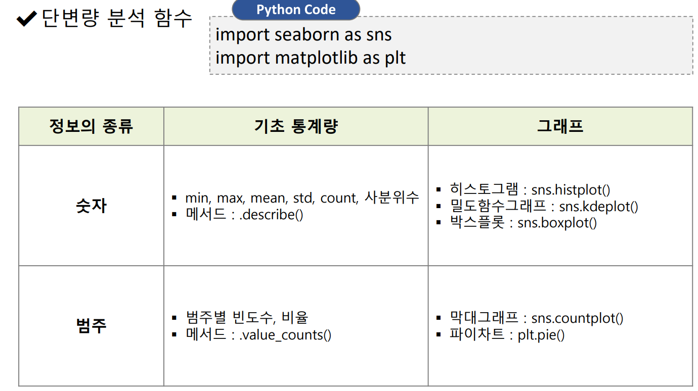

# 3.Data Analysis Basic
### 데이터 분석 기초
0. [데이터 분석 정리](./데이터_분석_정리.md)
1. [이변량 분석 숫자 vs 숫자](./이변량_분석_숫자_vs_숫자.ipynb)  
2. [이변량 분석 숫자 vs 범주](이변량_분석_숫자_vs_범주.ipynb)  
3. [이변량 분석 범주 vs 숫자](./이변량_분석_범주_vs_숫자.ipynb)  
4. [이변량 분석 범주 vs 범주](./이변량_분석_범주_vs_범주.ipynb)  
5. [평균 추정과 신뢰 구간](평균%20추정과%20신뢰%20구간.ipynb)  
##### 기본 사용되는 라이브리러 요약
- matplotlib  
- seaborn  
- pandas  
- numpy  
- scipy.stats  
##### 단변량
  
##### 이변량
  
데이터 분석의 시작점으로 감이 잡히지 않을 때,
**밀집 구간**, **희박한 구간** 찾아서 왜 그런지 **파악**하기부터 해보자

1. 분석/모델링을 위한 데이터 구조를 이해한다.
2. 정보의 종류(숫자, 범주)에 따라 데이터의 분포를 확인하고 비지니스를 파악할 수 있다.
3. 두 정보를 분석할 때, 적절한 도구를 사용하여 관계를 파악해 낼 수 있다.

- 모집단(Population)과 표본(Sample)
    - 모집단 : 우리가 알고 싶은 대상 전체 영역(데이터)
        - 표본 : 그 대상의 일부 영역(데이터)
- 우리는 일부분으로 전체를 추정하고자 한다.
    - 모집단에 대한 가설 수립
        - 가설은 보통 x와 y의 관계로 표현한다.
            - X에 따라 Y가 차이가 있다.
            - X와 Y는 관계가 있다.
    - 표본을 가지고 가설이 진짜 그러한 지 검증(검정)
    
    **⇒ 즉, 표본은 모집단을 지향한다는 것을 전제로 분석**
    

- **비지니스 이해단계에서**
    - 비지니스 문제로부터 우리의 관심사(Y)를 도출하고,
    - Y에 영향을 주는 요인(X)들을 뽑아서
    - 초기 가설 수립

- **p-value 란?**
    
    어떤 사건이 우연히 발생할 확률을 말한다.
    예를 들어 p-value 값이 0.05보다 작다는 것은 어떤 사건이 우연히 일어날 확률이 5%보다 작다는 의미이다.
    
- **우리가 사용할 도구(이미지)**
    
    X와 Y의 관계가 강한지, 약한지 살펴보기 위해 아래 사진과 같은 도구들을 이용한다.

    그러나, **보이는게 전부가 아님**을 명심해야한다.