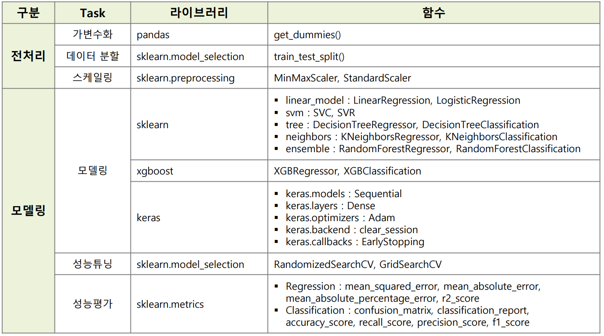

# 총 파일 정리
- [알고리즘별 코드 작성 및 테스트](./JupyterFiles/)  
# 목차
- [0.머신러닝 개념과 관련 용어](./0.what_is_ML.md)  
- [1.회귀와 분류 구분](./1.classification_and_regression.md)  
- [2.모델링 코드 작성 방법](./2.how_to_code_modeling.md)  
- [3.모델 성능 평가 방법](./3.how_to_evaluate_model.md)  
- [4.기본 알고리즘 원리](./4.algorithm_basic.md)  
- [5.효율적인 성능 평가 방법](./5.efficient_evaluate_performance.md)  
- [6.하이퍼파리미터 튜닝](./6.HyperParameter.md)  
- [7.앙상블 알고리즘 등](./7.Ensemble.md)  

  
⇒ 이를 통 최소한 머신러닝 모델링 코드를 작성할 수 있다.
### 미니 프로젝트
- [Mini Project](./JupyterFiles/project/)  
- [Mini Project2](./JupyterFiles/project2/)  
  
## 사용 라이브러리 간단 요약
  
1. 분리하기
    
    ```python
        from sklearn.model_selection import train_test_split
    ```
    
2. 회귀문제
    
    ```python
        # 학습 알고리즘
        from sklearn.linear_model import LinearRegression
        from sklearn.neighbors import KNeighborsRegressor
        from sklearn.tree import DecisionTreeRegressor
        from sklearn.ensemble import RandomForestRegressor
        from xgboost import XGBRegressor
        from lightgbm import LGBMRegressor
        
        # 평가 알고리즘
        from sklearn.metrics import mean_absolute_error
        from sklearn.metrics import mean_squared_error
        from sklearn.metrics import mean_absolute_percentage_error
        from sklearn.metrics import r2_score
    ```
    
3. 분류문제
    
    ```python
        # 학습 알고리즘
        from sklearn.neighbors import KNeighborsClassifier
        from sklearn.tree import DecisionTreeClassifier
        from sklearn.linear_model import LogisticRegression
        from sklearn.ensemble import RandomForestClassifier
        from xgboost import XGBClassifier
        from lightgbm import LGBMClassifier
        
        # 평가 알고리즘
        from sklearn.metrics import accuracy_score
        from sklearn.metrics import recall_score
        from sklearn.metrics import precision_score
        from sklearn.metrics import classification_report
        from sklearn.metrics import confusion_matrix
    ```
    
4. 성능튜닝
    
    ```python
        from sklearn.model_selection import cross_val_score
        from sklearn.model_selection import RandomizedSearchCV
        from sklearn.model_selection import GridSearchCV
    ```