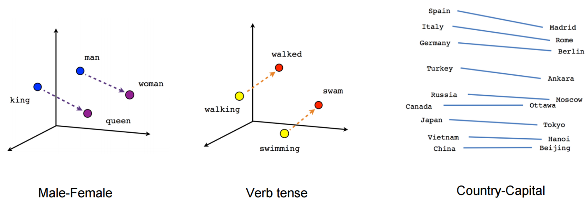

# 딥러닝에서의 임베딩(Embeding)

## 딥러닝의 임베딩이란 ?
인공신경망 임베딩이란 이산된(discrete) 데이터를 연속된 벡터로 만들어주는 학습된 저차원 표현 방법'이다.  
   
사람이 사용하는 언어나 이미지는 0과 1로만 이루어진 컴퓨터 입장에서 그 의미를 파악하기가 어렵다.  
예를 들어 인간의 자연어는 수치화되어 있지 않은 데이터이기 때문에 특징을 추출해 수치화를 해줘야 한다.  
이 때 '언어의 벡터화'가 이뤄지고, 이런 일련의 과정을 Word Embedding이라고 한다.  
   
가장 기본적으로 사용되는 벡터화의 방법은 One-hot Encoding이다.  
   
## One-hot Encoding
- 필요한 정보를 담은 하나의 값만 1로 두고, 나머지 값은 0으로 설정하는 방법  
- 대부분의 값이 0을 갖고 단 한개의 1인 값을 가지는 일종의 Sparse Matrix(희소행렬)으로 표현된다.  
- 단어가 많을수록 벡터 공간만 커지는 비효율적인 방법이다.  
- 원-핫 인코딩은 단어가 무엇인지만을 알려줄 뿐 어떤 특징을 가지고 있는지 설명하지 못한다.  
→ 이를 해결하기 위해 Dense Matrix(밀집 행렬)로 변환하는 표현법이 제시되었다.  
   
즉, 사람이 사용하는 언어나 이미지를 컴퓨터에게 이해시키기 위해서는 어떤 **벡터 공간(Vector Space)에 우리가 표현하고자 하는 정보를 사상(mapping)**해야 한다.  
   
이미지의 경우 두 얼굴이 얼마나 닮았느냐 하는 문제에서 일반적으로 표현된 RGB 데이터를 비교하면 동일한 이미지라도 모든 pixel이 한쪽으로 1 pixel만큼 shift하게 되면 기존과는 매우 다른 이미지가 되므로 컴퓨터가 이미지를 구분할 수 없게 된다.  
   
이 때, **얼굴을 표현하는 고차원의 이미지 정보를 저차원으로 변환하면서 필요한 정보를 보존하는 것**을 **임베딩(Embedding)** 이라고 한다. 이런 임베딩을 통해 컴퓨터는 이미지 데이터에 대한 저차원의 임베딩 벡터를 통해 얼굴을 비교할 수 있는 것이다.  
   
## 텍스트 임베딩
위의 내용에서 설명한대로 텍스트를 표현할 때는 일반적으로 One-hot Encoding을 사용한 고차원의 희소행렬(Sparse Matrix)를 사용한다.  
   
높은 차원의 데이터로 인해 생기는 비효율성과 특징을 나타내기 어렵다는 단점으로 인해 임베딩을 수행하는데, 이 때 저차원의 밀집행렬(Dense Matrix)를 사용한다.  
   
- 임베딩 벡터  
    - 밀집행렬로 임베딩된 벡터는 **각 요소에서 단어의 서로 다른 특성을 나타낸다.**  
    - 각 요소에는 단어가 관련 특성을 대표하는 정도를 나타내는 0~1 사이의 값이 포함된다.  
    - 즉, 이런 **임베딩을 통해 텍스트를 단순히 '구분' 하는것이 아닌 의미적으로 '정의'하는 것이라고 볼 수 있다.**  
- 예시  
    - 'The squad is ready to win the football match'  
    - 'The team is prepared to achieve victory in the soccer game'  
    - 위 두 문장은 의미는 같지만 비슷한 단어가 거의 없다.  
    - 하지만 **각 문장의 임베딩 벡터에서는 의미적 인코딩이 매우 유사하기 때문에 임베딩 공간에 서로 가까이 놓인다.**  
      
   
## 이미지 임베딩
이미지의 경우 텍스트와 달리 이미지 데이터가 그 자체로 밀집행렬(Dense Matrix)라고 볼 수 있다.  
   
하지만 이런 고차원, 고밀도의 데이터를 일일이 비교해가며 비슷한 이미지를 찾는다는 것은 매우 비효율적이다.  
   
그러므로 **이미지의 저차원적 특성 벡터를 추출해 이미지에 포함된 내용이 무엇인지 나타내는 일정한 지표를 얻어 효과적으로 비교한다.**  
   