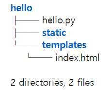

# 파이썬 Flask
- Flask는 경량 WSGI 웹 어플리케이션 프레임워크이다.
- 빠르고 쉽게 웹 어플리케이션을 개발할 수 있도록 설계되었다.
- [Flask 공식문서](https://flask-docs-kr.readthedocs.io/ko/latest/quickstart.html)  

## 간단하게 시작하기
- Jupyter notebook 환경에서 실행  
1. Make Project
```python
!mkdir -p hello/static
!mkdir -p hello/templates
!touch hello/hello.py
!touch hell/templates/index.html
```
- 위 코드 실행하여 아래와 같은 파일 구조를 만든다.  
  
2. Flask Route
```python
%%writefile hello/hello.py
from flask import *

# __name__ == __main__ : 시작점을 의미
app = Flask(__name__)

@app.route('/') # 기본 경로 접속시
def hello():
    return "Hello Flask" 

@app.route('/user')
def user():
    return render_template('index.html')

# debug=True : 서버 실행중 코드가 변경되면 바로 적용
app.run(debug=True)
```
3. Templates
```python
%%writefile hello/templates/index.html
<!DOCTYPE html>
<html>
    <head>
        <title>Document</title>
    </head>
        <body>
            <input id='txt-data', type='text'>
            <button id='get-data'>GetData</button>
            <div class='result'></div>
        </body>
</html>
```
4. Flask 실행 및 확인
- 위에서 만들어 놓은 hello.py를 실행한다.
```bash
python hello.py
```