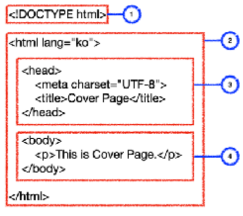

# HTML (Hyper Text Markyp Language)
- 웹문서를 작성하는 마크업 언어
##### 목차
- [HTML 구성요소](#html-구성요소)
- [HTML 기본구조](#html-기본구조)
- [HTML 페이지 구조](#html-페이지-구조)
- [HTML 문자열 태그](#html-문자열-태그)
- [HTML 목록 태그](#html-목록-태그)
- [HTML 테이블 태그](#html-테이블-태그)
- [HTML 이미지 태그](#html-이미지-태그)
- [HTML 입력 태그](#html-입력-태그)
## HTML 구성요소
- Document : 한페이지 전체의 HTML 코드
- Element : Document를 구성하는 Start Tag, End Tag, Text로 구성되어 있는 HTML 코드
- Tag : Element의 기능을 정의하는 HTML 코드 : Start Tag와 End Tag가 있음
- Attribute : Start Tag에 있는 Tag의 기능을 정의하는 속성값
- id : Element를 정의하는 Document에서 유일한 값
- class : Element를 정의하는 값으로 하나의 Element가 여러개의 class를 가질수 있음
- attr : id, class를 제외한 나머지 속성값 : href, scr, type, name 등등
- Text : 시작태그와 끝태그 사이에 있는 문자열
## HTML 기본구조
  
1. `<!DOCTYPE html>` : document 타입이 html 문서
2. <html> : 웹문서의 시작과 끝을 나타내는 태그
3. <head> : 웹문서의 정보에 대한 코드 작성
4. <body> : 웹문서에서 화면에 출력되는 코드 작성
## HTML 페이지 구조
- 시멘틱 태그 : sementic tag : 태그 이름으로 의미를 알수 있는 태그
    - <header> : 헤더 영역 표현
    - <nav> : 네이게이션 바 영역 표현
    - <main> : 전체 컨텐츠 영역 표현
    - <article> : 독립적인 컨텐츠 영역 표현
    - <section> : 컨텐츠 영역 표현 : article 태그 안에 여러개의 section 태그 작성
    - <aside> : 본문 오른쪽이나 왼쪽 영역 표현
    - <footer> : 웹문서 아래 영역 표현
- 시멘틱 태그로 웹페이지의 전체적인 구조를 구성
- 시멘틱 태그를 반드시 사용해야 하는것은 아님
## HTML 문자열 태그
- <h1> ~ <h6> : 제목 태그
- 
 : 한줄 문자열 태그
-   : 줄바꿈
-  : 한블럭 문자열 태그
- <pre> : 줄바꿈 띄어쓰기 적용 태그
- <code> : 코드 태그
- <strong>, <b> : 굵은 글씨 태그
- <small> : 작은 글씨 태그
- <em>, <i> : 이택릭체 태그
-  : 윗첨자 태그
-  : 아래첨자 태그
- <u> : 밑줄 태그
- <del> : 삭제선 태그
- <a href="" target="_blank">
## HTML 목록 태그
- <ol>, <li> : 순서있는 목록 ( ol : ordered list )
- <ul>, <li> : 순서없는 목록 ( ul : unordered list )
- <dl>, <dt>, <dd> : 설명 목록 : 불릿 없음 ( dt : 이름, dd : 값 )
## HTML 테이블 태그
- <table> : 테이블 태그
- <caption> : 테이블 제목
- <thead> : 테이블 컬럼
- <tbody> : 테이블 내용
- <tr> : 테이블 로우(row)
- <th>, <td> : 테이블 데이터
## HTML 이미지 태그
-  : 이미지 태그 ( src : 이미지 파일 경로, alt : 대체 텍스트,
width : 넓이, height : 높이 )
## HTML 입력 태그
- <form method="" name="", action="" target="_blank"> : 로그인 페이지와 같이 여러개의 데이터
를 서버로 전달할때 사용하는 태그
    - method : 데이터 전달 방법 정의 : get, post 방식 사용가능
    - name : form 태그의 이름 정의
    - action : 데이터를 전달할 URL
    - target="_blank" : 새로운 탭을 열어서 데이터 전달 )
    * 자바스크립트를 사용하여 다른 입력 태그에서 데이터를 하나씩 가져와 데이터 전달하는 방법도 가능
- <fieldset> : form 태그에서 데이터를 입력하는 영역을 묶어주는 태그
- <legend> : fieldset 태그로 묶은 그룹에 이름을 붙이는 태그
- <input type="" placeholder="" maxlength="" name="" value="" readonly required autofocus> : 문자열을 입력받는 태그
    - type : 다양한 형태의 입력 태그 사용
    - text : 문자열 입력 속성
    - password : 패스워드 입력 속성
    - email : 이메일 입력 속성
    - checkbox : 체크박스 생성
    - radio : 라디오버튼 생성
    - datetime : 날짜데이터 입력 속성
    - submit : form 태그의 action 에 설정한 URL로 페이지 이동
    - reset : 입력 취소 속성
    - file : 파일 첨부 속성
    - placeholder : 입력전에 입력태그에 출력되는 문자열 속성
    - maxlength : 최대입력 문자열 길이 설정 속성
    - name : input 태그를 묶어주는 문자열 속성
    - value : 선택했을때, 서버로 전송할 데이터를 입력하는 속성
    - readonly : 데이터를 입력할수 없고 읽을수만 있는 속성
    - required : 필수 입력 속성
    - autofocus : 자동으로 입력창의 포커스 설정
- <label> : input 태그에 이름을 붙일수 있는 태그
- <textarea cols="" rows=""> : 여러줄의 문자열을 입력할수 있는 태그
    - cols : 컬럼수 태그의 너비 설정
    - rows : 행수 태그의 높이 설정

