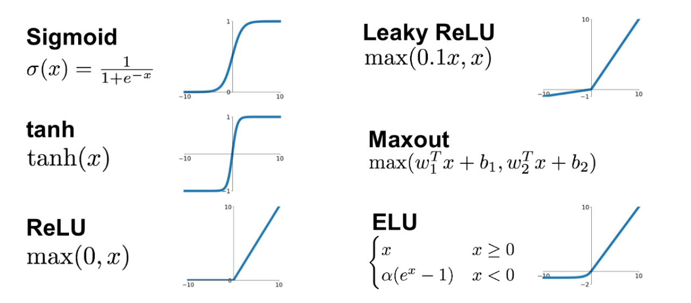
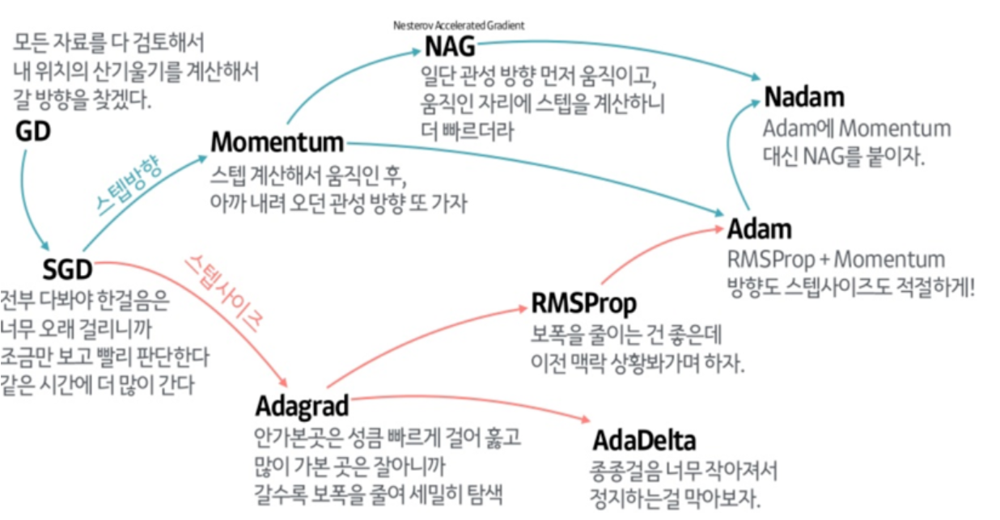

## 신경망으로 해결 가능한 문제
퍼셉트론 덩어리에 활성화 함수, 네트워크 구조 변경을 통해서 문제를 해결할 수 있다.  
대표적으로 신경망으로 해결할 수 있는 문제는 Classification(분류)문제와 Regression(회귀)문제로 나눌 수 있다.  
### 참고 코드 파일
- [MNIST](../jupyter/flatten_convolution_pooling/MNIST.ipynb)  
- [cifar10](../jupyter/flatten_convolution_pooling/Cifar10.ipynb)  
- [Skip Connection](../jupyter/flatten_convolution_pooling/Skip_Connection.ipynb)  

# 기본 구조
0. 라이브러리 불러오기  
```python
import tensorflow as tf
```
1. 모델 구조 생성  
```python
X = tf.keras.layers.Input(shape=[1])
Y = tf.keras.layers.Dense(1)(X)
model = tf.keras.models.Model(X,Y)
model.complie(loss='mse')
```
2. 모델 학습  
```python
model.fit(x_train, y_train, epochs=1000, verbos=0)
model.fit(x_train, y_train, epochs=10)
```
   
### 파일 목록  
- 기초
    - [레모네이드 판매 예측](./jupyter/basic/lemonade_sales_predict.ipynb)  
    - [아이리스 품종 예측](./jupyter/basic/iris_classification.ipynb)  
    - [보스톤 집 값 예측](./jupyter/basic//boston_house_price_predict.ipynb)  
    - [히든 레이어 활용 보스톤 집 값 예측](./jupyter/basic/hidden_layer.ipynb)  
   
# Batch Normalization (배치 정규화)
배치 정규화(Batch Normalization)는 학습 과정에서 Batch마다 평균과 분산을 활용하여 데이터의 분포를 정규화하는 과정을 말한다.  
   
- 장점
    - 어떠한 데이터 분포가 입력으로 들어와도 모두 정규화하기 때문에 모든 Layer의 Feature가 동일한 Scale이 되도록 만드는 점.  
    - Batch Normalization 시 추가적인 스케일링과 편향(bias)을 학습함으로써 활성화 함수(Activation Function) 종류에 맞게 적합한 분포로 변환이 가능  
```python
# 모델 생성
X = tf.keras.Input(shape = [784]) 

H = tf.keras.layers.Dense(196)(X) 
H = tf.keras.layers.BatchNormalization()(H) 
H = tf.keras.layers.Activation('swish')(H)

Y = tf.keras.layers.Dense(10, activation="softmax")(H)

model = tf.keras.Model(X, Y)
model.compile(loss="categorical_crossentropy", metrics="accuracy")
model.summary()
```
   
# Activation function (활성화 함수)
### 활성화 함수란
퍼셉트론의 출력값을 설정 해주는 함수라 생각하면 된다.  
활성화 함수에 회귀모델, 분류모델에 따라 함수(Softmax등..)를 넣으면,
회귀는 입력(결과값)을 그대로 전달  
분류는 입력(결과값)을 0~1(확률값)으로 바꿔서 전달  
   
### 활성화 함수의 종류
활성화 함수는 전체 신경망의 출력값을 결정하기 때문에 중요한 의미를 갖는다.  

- sigmoid 함수  
    - 0~1의 값  
- Leaky ReLU 함수  
    - max(0.1x, x)  
- tanh 함수  
    - tanh(x)  
- Maxout 함수  
    - max(w_1x+b1, x_2x+b2)  
- ReLU 함수  
    - max(0,x)  
- ELU 함수  
    - if x>=0이면 x,  
    - if x<0이면 α(e**x -1)  
   
### 활성화 함수가 필요한 이유
활성화 함수는 신경망에 비선형성을 더해준다.  
   
딥러닝으로 해결하려는 문제들은 대부분 단순한 문제들이 아니다.  굉장히 복잡하고 난잡한 문제들이기 때문에, 데이터 속에 숨겨져 있는 회귀 선, 경계면은 입력데이터(X)의 다차원 공간에서 굉장히 해괴한 곡선(비선형)의 모습을 보여준다.  
   
만약 활성화 함수를 사용하지 않고 입력데이터(X)에 가중합만 이용한다면, 복잡하고 유연한 함수가 생성되는 것이 아니라, 데이터의 선형 변형만을 하기 때문에 적절한 핏팅이 어렵다.  
   
간단하게 말하자면, 활성화 함수를 써야만 주어진 데이터를 설명하는 복잡한 형상이나 선, 경계면을 찾을 수 있다.  
   
# loss function (로스 펑션)
### loss function이란 ?
로스 펑션은 라벨값과 예측값의 차이를 로스(Loss)라고 말하고 이들을 계산하기 위한 함수를 의미한다.  그리고 학습은 로스(Loss)를 최소화 하는 방향으로 가중치를 업데이트하며 진행된다.  
   
학습의 진행이 로스(Loss)를 최소화 하는 방향으로 진행되기 때문에, 로스 펑션(Loss function)을 제대로 정하는 것은 매우 중요하다. 같은 네트워크를 사용한다고 하더라도 로스 펑션을 바꾸면 가중치는 다른 값으로 업데이트가 진행되고, 최종적으로 뉴럴넷의 성능이 달라지기 때문이다.  
   
### 회귀에서 쓰이는 loss function
- mse  
- Mean Squared Error : 라벨값과 예측값 차이의 제곱을 로스로 계산하는 방법  
   
### 분류에서 쓰이는 loss function
- categorical_crossentropy : 훈련데이터 label(y/target)값이 원-핫 벡터 형태인 경우  
- sparse_categorical_crossentropy : 훈련데이터 label(y/target)값이 정수(int)형태인 경우  

- softmax 함수
    입력 받은 값을 출력으로 0~1사이의 값으로 모두 정규화하여 출력 값들의 총합은 항상 1이 되는 특성을 가진 함수이다.    
    소프트 맥스 결과값을 One Hot Encoder의 입력으로 입력하면 가장 큰 값만 True, 나머지는 False 값이 나오게 하여 이용 가능하다.  
    
    - 출력은 0~1 사이의 실수이다.  
        - 출력을 '확률'로 해석할 수 있다.  
    - 출력의 총합은 1이다.  
    - 소프트맥스 활성화 함수를 적용해도 원소의 대소 관계는 변하지 않는다.  
        - 소프트맥스 활성화 함수에 사용되는 지수 함수가 단조 증가 함수이기 때문  
        - 즉, 출력층의 소프트맥스 활성화 함수는 생략해도 된다.  
-  crossentropy
    실제 분포 p에 대하여 알지 못하는 상태에서, 모델링을 통하여 구한 분포인 q를 통하여 p를 예측하는 것, q와 p가 모두 들어가서 크로스 엔트로피(cross-Entropy)라고 한다고 한다.   

    머신러닝을 통한 예측 모형에서 훈련 데이터에서는 실제 분포인 p 를 알 수 있기 때문에 cross-entropy 를 계산할 수 있다. 즉, 훈련 데이터를 사용한 예측 모형에서 cross-entropy 는 실제 값과 예측값의 차이 (dissimilarity) 를 계산하는데 사용할 수 있다는 것이다.  

    cross-entropy에서는 실제값과 예측값이 맞는 경우에는 0으로 수렴하고, 값이 틀릴경우에는 KL-Divergence만큼 값이 커지기 때문에, 실제 값과 예측 값의 차이를 줄이기 위해 사용한다. **cross-entropy의 값은 항상 entropy의 값보다 크다.**  
- 부가 설명
    True, False와 같이 두개를 클래스를 분류하는 문제가 아니라 [강아지, 고양이, 하마, 사슴, 기린]과 같은 다항 분류문제에서는 마지막 퍼셉트론의 활성화 함수를 Sigmoid로 바꾸는 것만으로는 예측할 수 없다.  
       
    그냥 Output 레이어 이전 레어어 퍼셉트론들에 마음대로(?) 활성화 함수을 붙이고 이 값들을 Softmax레이어를 통과시키면, Softmax레이어 안에서는 이전 레이어 출력값의 크기에 따른 각각의 비율을 계산하여 최종 출력값으로 내보낸다.
       
    그렇기 때문에 각 클래스를 대표하는 모든 노드들의 출력값의 합은 1이고 범위는 0~1사이로 제한된다.
    이 상태에서 Cross Entropy의 로스를 계산할 수 있다. 
   
# Optimizer(옵티마이저)
### Optimizer란?
뉴럴넷의 가중치를 업데이트하는 알고리즘이라고 생각하시면 이해가 간편하실 것이다.  
   
**하이퍼파리미터를 결정**하여 **모델이 정확하게 결과**를 뱉어낼 수 있도록 하는 것이 **학습**의 핵심이다.  
그러기 위해 loss function을 정의하여야 하며, 이를 최적화 해야한다. 
최솟값을 찾아가는 것을 **최적화 = optimization** 이라하며,  
이를 수행하는 알고리즘이 **최적화 알고리즘 = optimizer**이다.  
   


- Gradient Descent (경사하강법) : 함수의 기울기(경사)를 구하여 함수의 극값에 이를 때까지 기울기가 낮은 쪽으로 반복하여 이동하는 방법.  
    ⇒ SGD (batch 학습)  
- Momentum (관성) : 이전에 이동했던 방향을 기억해서 다음 이동의 방향에 반영  
    ⇒ NAG  
- Adagrad (Adaptive Gradient) : 많이 이동한 변수(w)는 최적값에 근접했을 것이라는 가정하에 , 많이 이동한 변수(w)를 기억해서 다음 이동의 거리를 줄인다.  
    ⇒ RMSprop  
- Adam (RMSprop + Momentum) : 진행하던 속도에 **관성**을 주고, 최근 경로의 곡면의 변화량에 따른 **적응적 학습률**을 갖는 알고리즘이다.  
   
# 오버피팅, 언더피팅
## 오버피팅(Overfitting)
- 너무 과도하게 데이터 모델을 학습(learning)을 한 경우를 의미
- train data에 대한 정확도는 좋지만, 실제 test에서는 에러가 날 수 있는 상황
### 이를 해결하기 위한 대표적인 방법 3가지
- Early Stop
    - 트레이닝 세트에 가중치가 최적화 되기 이전에 학습을 조기종료 시키는 방법이다.
    - 가중치 업데이트에 테스트 세트를 포함시키지 않고 에러 모니터링만 하다가 테스트셋의 학습이 진행될수록 사용자가 지정한 횟수(ex, 5회)동안 로스가 상승한다면 오버핏이 나타난다고 간주하고 학습을 중지한다.
    ```python
    # 콜백함수 만들기
    early = tf.keras.callbacks.EarlyStopping(monitor = 'val_loss',
                                            min_delta = 0, # 이보다 작게 변하면 변한다고 안할거임.
                                            patience = 10, # 이 회수(epoch)동안 개선이 없으면 끝냄
                                            restore_best_weights=True)
    # 모델 학습
    model.fit(x_train, y_train, epochs=1000, batch_size=128, validation_split=0.2, callbacks=[early])
    ```
- Weight decay
    - 로스펑션에 추가적인 패널티 텀을 붙여서 로스펑션을 수정하여 학습하는 방법이다.
- Dropout
    ```python
    # 모델 생성
    X = tf.keras.Input(shape = [784]) 

    H = tf.keras.layers.Dense(196)(X) 
    H = tf.keras.layers.BatchNormalization()(H) 
    H = tf.keras.layers.Activation('swish')(H)

    H = tf.keras.layers.Dropout(0.5)(H)
    H = tf.keras.layers.Dense(49)(H) 
    H = tf.keras.layers.BatchNormalization()(H) 
    H = tf.keras.layers.Activation('swish')(H)

    H = tf.keras.layers.Dropout(0.5)(H)
    H = tf.keras.layers.Dense(16)(H) 
    H = tf.keras.layers.BatchNormalization()(H) 
    H = tf.keras.layers.Activation('swish')(H)

    H = tf.keras.layers.Dropout(0.5)(H)
    Y = tf.keras.layers.Dense(10, activation="softmax")(H)

    model = tf.keras.Model(X, Y)
    model.compile(loss="categorical_crossentropy", metrics="accuracy")
    model.summary()

    ```
    - 랜덤 포레스트의 앙상블과 매우 유사한 방법이다.
    - 미니 배치마다 히든 레이어에서 임의의 노드들을 랜덤으로 선택해서 학습을 진행한다. 남겨진 퍼셉트론과 연결된 가중치는 drop안할 때보다 더 강한 가중치 값을 가지게 된다. 하지만, 실제 테스트(inference)시에는 drop하지 않고 모든 가중치에 (1-drop_rate)%를 곱해 전체 가중치를 한번 스케일링하여 Prediction한다.
## 언더피팅(Underfitting)
- 너무 단순하게 데이터 모델을 학습(learning)을 한 경우를 의미
- 너무 단순화하여, 실제 test에서 에러가 많이 발생하는 상황
- 이를 해결하기 위해서는
    - 적당한 모델을 선택 및 개발하는 방법
    - 학습을 더 많이 하는 방법 ⇒ 오버피팅이 날 경우 오버피팅의 해결방법 추가
   
# 학습 history 시각화
```python
# 학습한 모델을 저장
result = model.fit(x_train, y_train,epochs=20, batch_size=128, validation_split=0.2)
model.evaluate(x_test, y_test)

# 시각화
import matplotlib.pyplot as plt
plt.plot(result.history['loss'])
plt.plot(result.history['val_loss'])
plt.legend(['loss', 'val_loss'])
plt.show()
```


   
# 모델 저장 및 로드하기
```python
# 방법 1. 가중치와 모델을 한꺼번에 저장했다가 꺼내는 방법
model.save('my_model.h5')
my_model = tf.keras.models.load_model('my_model.h5')
# 방법 2. 가중치와 모델을 따로 저장했다가 꺼내는 방법
with open('my_model.json', 'w') as f:
f.write(model.to_json())
model.save_weights('my_weights.h5')
with open('my_model.json', 'r') as f:
my_model = tf.keras.models.model_from_json(f.read())
my_model.load_weights('my_weights.h5')
```
   
# 문자열 입력부분은 모두 함수로 대체가 가능
아래와 **1번 코드 블럭**을 **2번 코드 블럭** 같이 대체 가능

```python
# 1번 코드 블럭
X = tf.keras.Input(shape=[784])
H = tf.keras.layers.Dense(120, activation='swish')(X)
H = tf.keras.layers.Dense(84, activation='swish')(H)
Y = tf.keras.layers.Dense(10, activation='softmax')(H)
model = tf.keras.Model(X, Y)
model.compile(
loss='categorical_crossentropy',
optimizer='adam'
metrics='accuracy'
)
```

```python
# 2번 코드 블럭
X = tf.keras.Input(shape=[784])
H = tf.keras.layers.Dense(120, activation=tf.keras.activations.swish)(X)
H = tf.keras.layers.Dense(84, activation=tf.keras.activations.swish)(H)
Y = tf.keras.layers.Dense(10, activation=tf.keras.activations.softmax)(H)
model = tf.keras.Model(X, Y)
model.compile(
loss=tf.keras.losses.categorical_crossentropy,
optimizer=tf.keras.optimizers.Adam(),
metrics=tf.keras.metrics.categorical_accuracy
)
```

# Skip Connection 스킵 커넥션
신경망 모델 학습 시 모델의 층이 깊어질수록 학습 결과가 좋다.  
하지만 층을 또 너무 깊게 쌓아버리면 문제가 생긴다.  
skip connection을 적용하여 레이어를 더욱 깊게 쌓을 수 있다.  

합성곱 계층을 건너뛰어 출력에 바로 더하는 구조이다.  
```python
# 모델 생성
# skip connection을 사용할 때, 매개변수의 차원의 개수는 같아야함
# 아래 코드를 예시로 들면, 
# 앞서 H - 히든레이어층의 Dense는 256이고
# skip connection을 이용해 레이어를 추가하려고 하는 히든레이어는 H1

X = tf.keras.Input([32, 32, 3])
H = tf.keras.layers.Flatten()(X)

H = tf.keras.layers.Dense(256)(H)
H = tf.keras.layers.BatchNormalization()(H)
H = tf.keras.layers.Activation("swish")(H)

# 여기 부분이 skip connection 레이어층 쌓기 부분
for i in range(32):
    H1 = tf.keras.layers.Dense(256)(H)
    H1 = tf.keras.layers.BatchNormalization()(H1)
    H = tf.keras.layers.Add()([H,H1])
    H = tf.keras.layers.Activation("swish")(H)

Y = tf.keras.layers.Dense(10, activation='softmax')(H)

model = tf.keras.Model(X,Y)
model.compile(loss='categorical_crossentropy', metrics='accuracy')
model.summary()
```