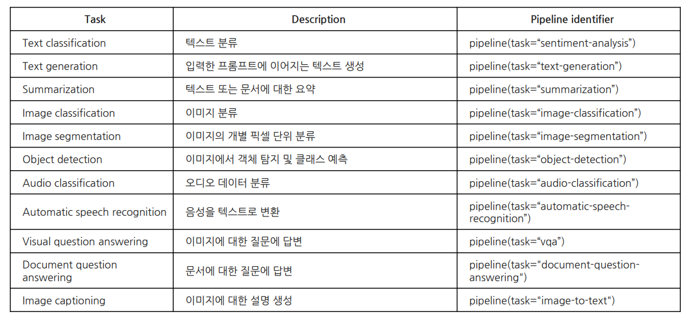

# 간단한 딥러닝 라이브러리
## 파일
- [transformers](../jupyter/pipeline.ipynb)
## 필요 라이브러리
- transformer
    - 자연어처리
- datasets
    - 데이터셋
- xformers
    - 트랜스포머 가속기
```
# 트랜스포머
pip install transformers
# 데이터셋
pip install datasets
# 텐서플로우
pip install xformers 
```
