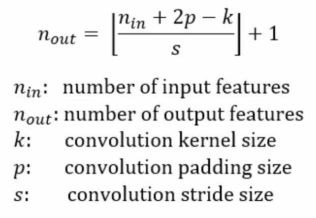

# Computer Vision

### 파일 목록
- [notMNIST Small](./jupyter_file/not_MNIST_small.ipynb)  
    - 데이터 용량이 크기 때문에, 따로 데이터를 다운 받아줘야함  
- [notMNIST Small 2(CNN 사용)](./jupyter_file/not_MNIST_small_2.ipynb)  
    - 데이터 용량이 크기 때문에, 따로 데이터를 다운 받아줘야함
- [CNN MNIST](./jupyter_file/CNN_MNIST.ipynb)  
- [CNN Fashion MNIST](./jupyter_file/CNN_MNIST_2.ipynb)    
- [CNN MNIST 종합 및 내 손글씨 확인해보기](./jupyter_file/MNIST.ipynb)  
    - CNN 이용한 MNIST 모델링 저장 및 내 손글씨 테스트해보기  

 
## CNN
### CNN 이란?
이미지에 특화된 신경망 구조이다.  
위치 정보를 보존하여 특징을 추출한다.  
### 커널(kernel)
커널(kernel)은 필터(filter), 마스크(mask)와 같은 말이다.  
일반적으로 정사각 행렬으로 정의되고 CNN에서 학습의 대상은 필터 파라미터 이다.  
커널의 기능은 이미지로부터 내가 원하는 정보(특징)만을 추출하는 것이다.  
커널은 이미지 데이터를 지정된 간격(stride)으로 움직이며 합성곱(convolution)을 수행하고, 합성곱 연산을 통해 나온 결과가 feature map 이다.  
- feature map 크기 구하는 공식  
  
  
### 풀링(Pooling)
CNN 에서 pooling layer는 네트워크의 파라미터 갯수나 연산량을 줄이기 위해 input에서 spatial 하게 downsampling을 진행해 사이즈를 줄이는 역할을 한다. 이로 인하여 feature map의 weight parameter 갯수를 줄이고 연산량을 줄인다. 일반적으로 CNN에서는 Convolution layer 다음에 들어간다.  

- max pooling : 영역 안에서 가장 높은 값 하나를 남긴다.  
    
    ⇒ 유의미한 정보가 가장 높은 signal을 가질것이라는 가정이 기저에 있다.  
    
- average pooling : 영역 안에서 평균 값을 하나 남긴다.  
    
    ⇒ 평균값을 넘기는 것이 noise도 줄이고 그 영역을 잘 설명할 것이다는 기저에 있다.  
    
- l2-norm pooling 등  

#### 활용하는 영역  
- OCR (Optical Character Recognition) : 문서의 텍스트를 인식하고 식별.  
- Vision Biometrics : 홍채 패턴 인식을 통해 사람들을 구분합니다.  
- Object Recognition : 실시간의 이미지나 스캔 입력을 가지고 제품을 분류합니다. 
- Object Detection : 객체 탐지 
- Special Effects : 모션 캡처 및 모양 캡처, 영화에서의 CGI.  
- 3-D Printing and Image Capture : 영화, 건축 구조 등에 사용됩니다.  
- Sports : 경기에서 필드에 추가 라인을 그리거나 이를 기반으로 영상 판독을 합니다.  
- Social Media : 얼굴 모양에 맞추어 착용되는 이미지.  
- Smart Cars : 사물과 사람을 인지할 수 있습니다.  
- Medical Imaging : 3D 이미징 및 이미지 유도 수술.  
  