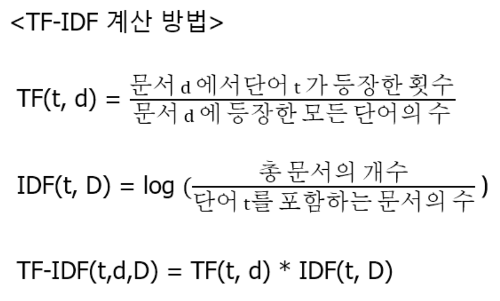

# Natural Language Processing 자연어 처리 

##### 코드 파일
[[기초] 자연어 처리 : 여러가지 유사도 측정 방법](./jupyter/Similarity.ipynb)  
[[기초] 자연어 처리 : TF 뉴스 정보 수집 및 키워드 분석 - Rss Information Research](./jupyter/rss_ir_TF2.ipynb)  
[[기초] 자연어 처리 : TF-IDF 뉴스 정보 수집 및 분석 - Rss Information Research](./jupyter/rss_ir_TF-IDF.ipynb)  
[[기초] 자연어 처리 : Cosine Similarity 뉴스 정보 수집 및 키워드 분석 - Rss Information Research](./jupyter/rss_ir-CosineSimilarity.ipynb)  
   
[[활용] 자연어 처리 : 영화 리뷰 감정 분석하기](./jupyter/Sentiment_movie_review.ipynb)  
   
##### 자연어처리 외의 코드 파일
[[딥러닝] ANN Implementation(Keras)](./jupyter/deeplearning/ANN_Implementation.ipynb)  
[[딥러닝] CNN Implementation(Keras) - MNIST](./jupyter/deeplearning/CNN_Implementation(Mnist).ipynb)  
[[딥러닝] CNN Implementation(Keras) - CIFAR10](./jupyter/deeplearning/CNN_Implementation(CIFAR10).ipynb)  
[[딥러닝] RNN Implementation(Keras)](./jupyter/deeplearning/RNN_Implementation.ipynb)  
[[딥러닝] GAN Implementation(Keras)](./jupyter/deeplearning/GAN_Implementation.ipynb)  
[[딥러닝] GAN Implementation(Keras) Easy](./jupyter/deeplearning/GAN_Implementation(Easy).ipynb)  
   
##### MD 파일
- [자연어 처리 -  텍스트 전처리(Text Preprocessing)](./mdFiles/NLP_text_preprocessing.md)  
- [자연어 처리 - 워드 임베딩(Word Embedding)](./mdFiles/NLP_WordEmbedding.md)  
  
##### 참고 사이트
**Machine Learning(N-grams)**

- [sklearn-tutorial](https://scikit-learn.org/stable/tutorial/text_analytics/working_with_text_data.html)

**Hyperparameter Tuning(Optional)**

- [grid search tutorial sklearn](https://scikit-learn.org/stable/modules/grid_search.html)
- [optuna tutorial](https://optuna.org/#code_examples)
- [ray-tune tutorial](https://docs.ray.io/en/latest/tune/examples/tune-sklearn.html)

**Deep Learning(Sequence)**

- [Google Tutorial](https://developers.google.com/machine-learning/guides/text-classification)
- [Tensorflow Tutorial](https://www.tensorflow.org/tutorials/keras/text_classification)
- [Keras-tutorial](https://keras.io/examples/nlp/text_classification_from_scratch/)

**Using pre-trained model(Optional)**

- [BERT-tutorial](https://www.tensorflow.org/text/guide/bert_preprocessing_guide)
- [HuggingFace-Korean](https://huggingface.co/models?language=korean)

### TF-IDF
TF-IDF란  
정보 검색과 텍스트 마이닝에서 이용하는 가중치로, 여러 문서로 이루어진 문서군에 있을 때,  
어떤 단어가 특정 문서 내에서 얼마나 중요한 것인지를 나타내는 통계적인 수치이다.   
즉, 문서의 핵심어를 추출하거나, 검색 엔진에서 검색 결과의 순위를 결정하거나,  문서들 사이의 비슷한 정도를 구하는 등의 용도로 사용할 수 있다.   
- **TF(단어 빈도, term Frequency)**
    - 특정한 단어가 문서 내에 얼마나 자주 등장하는지를 나타내는 값이다.  
- **DF(문서 빈도, Document Frequency)** : 단어가 문서 내에서 자주 사용되는 정도
- **IDF(역문서 빈도, Inverse Document Frequency)** : DF값의 역수  
    - 문서군의 성격에 따라 결정 된다.  
    - 한 단어가 문서 집합 전체에서 얼마나 공통적으로 나타나는지를 나타내는 값이다.  
**즉 TF-IDF는 TF와 IDF를 곱한 값이다.**   
  

#### 단어 표현
- 질문 : 어떻게 텍스트를 표현해야 자연어 처리 모델에 적용할 수 있을까?
    ⇒ 언어적인 특성을 반영하여 단어를 수치화 하는 방법 → **벡터**를 이용한다.
- 데이터 표현
    - 기본: One-Hot Encoding → 그러나 이 방식은 자연어 단어 표현에는 부적합
        - 단어의 의미나 특성을 표현할 수 없음
        - 단어의 수가 매우 많으므로 고차원 저밀도 벡터를 구성함
    - 벡터의 크기가 작으면서 단어의 의미를 표현하는 법 → 분포가설에 기반
        - 분포가설(Distributed Hypothesis): 같은 문맥의 단어, 즉 비슷한 위치에 나오는 단어는 비슷한 의미를 가진다.
        - 분포가설 기반의 두 가지 데이터 표현법
            - 카운트 기반 방법(Count-based): 특정 문맥 안에서 단어들이 동시에 등장하는 횟수를 직접 셈
            - 예측 방법(Predictive): 신경망 등을 통해 문맥 안의 단어들을 예측
- 정의
    - 텍스트가 얼마나 유사한지를 표현하는 방식
- 유사도 판단에는 다양한 방식이 존재함
    - 예시
        - 단순히 같은 단어의 개수를 사용해서 유사도를 판단하는 방법
        - 형태소로 나누어 형태소를 비교하는 방법
- 딥러닝 기반의 유사도 판단
- 텍스트를 벡터화 한 후 벡터화된 각 문장 간의 유사도를 측정하는 방식
- 대표적인 유사도 측정 방식
- 자카드 유사도, 코사인 유사도, 유클리디언 유사도, 맨하탄 유사도