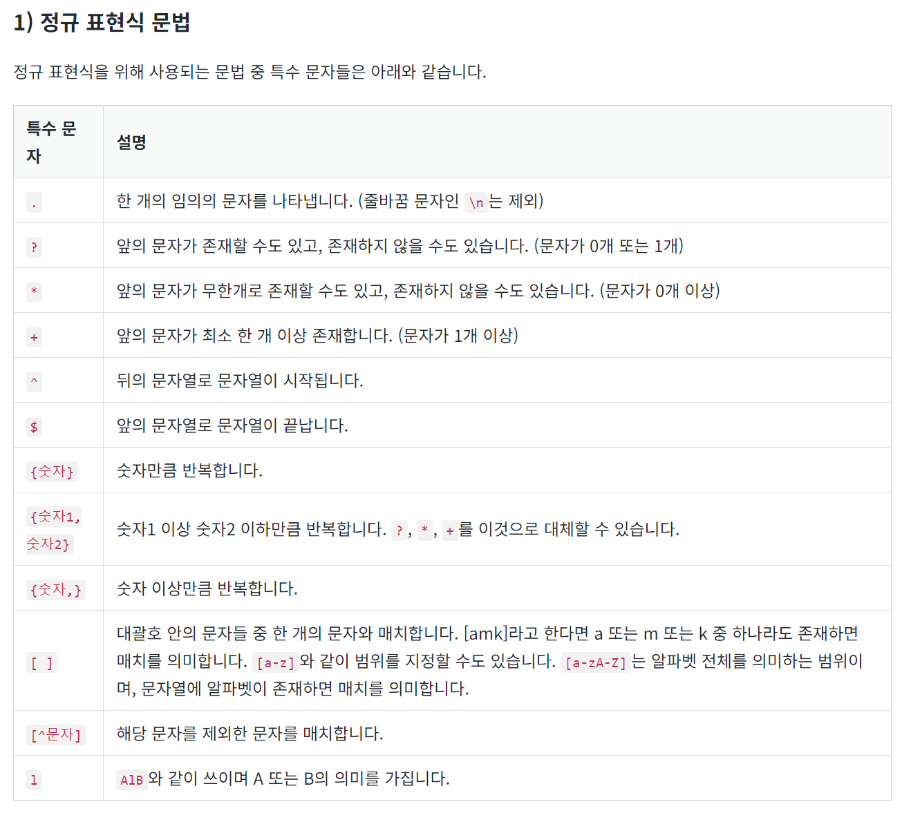
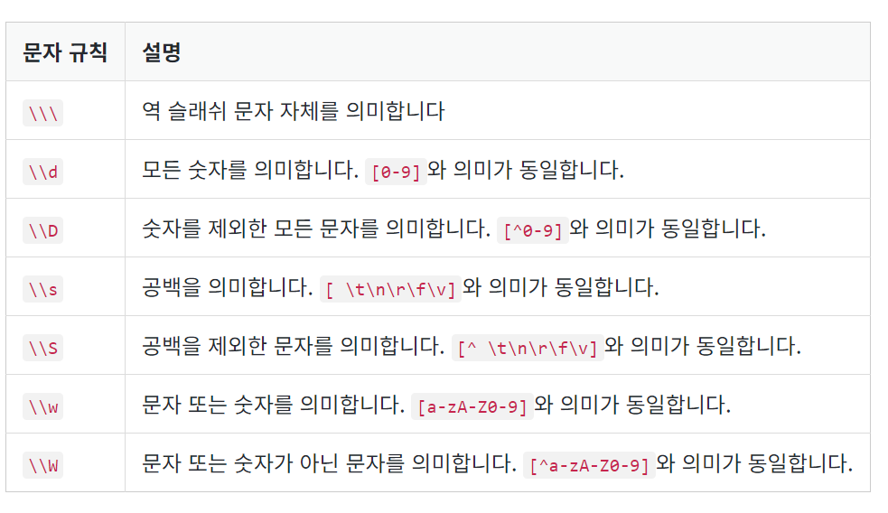
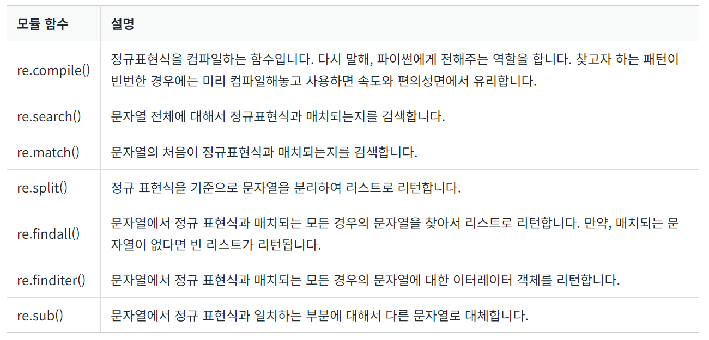

# 자언어 처리 - 텍스트 전처리

1. [토큰화](#1-토큰화)  
2. [정제 and 정규화](#2-정제-and-정규화)
3. [어간 추출 and 표제어](#3-정제-and-정규화)
4. [불용어](#4-불용어)
5. [정규 표현식](#5-정규-표현식)
6. [정수 인코딩](#6-정수-인코딩)
7. [패딩](#7-패딩)
8. 원-핫 인코딩
9. 데이터의 분리
10. 한국어 전처리 패키지
---
## 1. 토큰화
주어진 코퍼스(corpus)에서 토큰(token)이라 불리는 단위로 나누는 작업을 토큰화(tokenization)라고 한다. 토큰의 단위가 상황에 따라 다르지만, 보통 의미있는 단위로 토큰을 정의한다.

#### 단어 토큰화 코드 부분
코드 부분  
```python
from konlpy.tag import Okt
from konlpy.tag import Kkma

okt = Okt()
kkma = Kkma()

print('OKT 형태소 분석 :',okt.morphs("열심히 코딩한 당신, 연휴에는 여행을 가봐요"))
print('OKT 품사 태깅 :',okt.pos("열심히 코딩한 당신, 연휴에는 여행을 가봐요"))
print('OKT 명사 추출 :',okt.nouns("열심히 코딩한 당신, 연휴에는 여행을 가봐요")) 
```

실행 결과  
```
OKT 형태소 분석 : ['열심히', '코딩', '한', '당신', ',', '연휴', '에는', '여행', '을', '가봐요']
OKT 품사 태깅 : [('열심히', 'Adverb'), ('코딩', 'Noun'), ('한', 'Josa'), ('당신', 'Noun'), (',', 'Punctuation'), ('연휴', 'Noun'), ('에는', 'Josa'), ('여행', 'Noun'), ('을', 'Josa'), ('가봐요', 'Verb')]
OKT 명사 추출 : ['코딩', '당신', '연휴', '여행']
```

각 형태소 분석기는 성능과 결과가 다르게 나오기 때문에, 형태소 분석기의 선택은 사용하고자 하는 필요 용도에 어떤 형태소 분석기가 가장 적절한지를 판단하고 사용하면 된다.  

## 2. 정제 and 정규화
코퍼스에서 용도에 맞게 토큰을 분류하는 작업을 토큰화(tokenization)라고 하며, 토큰화 작업 전, 후에는 텍스트 데이터를 용도에 맞게 정제(cleaning) 및 정규화(normalization)하는 일이 항상 함께한다. 정제 및 정규화의 목적은 각각 다음과 같다.  
  
- 정제(cleaning) : 갖고 있는 코퍼스로부터 노이즈 데이터를 제거한다.
- 정규화(normalization) : 표현 방법이 다른 단어들을 통합시켜서 같은 단어로 만들어준다.

1. 규칙에 기반한 표기가 다른 단어들의 통합
2. 대, 소문자 통합
3. 불필요한 단어의 제거
4. 정규 표현식 이용

## 3. 어간 추출 and 표제어
정규화 기법 중 코퍼스에 있는 단어의 개수를 줄일 수 있는 기법인  
- 표제어 추출(lemmatization)
    - 표제어 추출은 단어들로부터 표제어를 찾아가는 과정이다.
    - 예를 들어 am, are, is는 서로 다른 스펠링이지만 뿌리 단어는 be이다.
- 어간 추출(stemming)
    - 어간 추출은 형태학적 분석을 단순화한 버전이라고 볼 수도 있다
    - 정해진 규칙만 보고 단어의 어미를 자르는 어림짐작의 작업이라고 볼 수도 있다.
    ```python
    from nltk.stem import PorterStemmer
    from nltk.tokenize import word_tokenize

    stemmer = PorterStemmer()

    sentence = "This was not the map we found in Billy Bones's chest, but an accurate copy, complete in all things--names and heights and soundings--with the single exception of the red crosses and the written notes."
    tokenized_sentence = word_tokenize(sentence)

    print('어간 추출 전 :', tokenized_sentence)
    print('어간 추출 후 :',[stemmer.stem(word) for word in tokenized_sentence])
    ```
    코드 실행 후  
    ```
    어간 추출 전 : ['This', 'was', 'not', 'the', 'map', 'we', 'found', 'in', 'Billy', 'Bones', "'s", 'chest', ',', 'but', 'an', 'accurate', 'copy', ',', 'complete', 'in', 'all', 'things', '--', 'names', 'and', 'heights', 'and', 'soundings', '--', 'with', 'the', 'single', 'exception', 'of', 'the', 'red', 'crosses', 'and', 'the', 'written', 'notes', '.']
    어간 추출 후 : ['thi', 'wa', 'not', 'the', 'map', 'we', 'found', 'in', 'billi', 'bone', "'s", 'chest', ',', 'but', 'an', 'accur', 'copi', ',', 'complet', 'in', 'all', 'thing', '--', 'name', 'and', 'height', 'and', 'sound', '--', 'with', 'the', 'singl', 'except', 'of', 'the', 'red', 'cross', 'and', 'the', 'written', 'note', '.']
    ```

## 4. 불용어
불용어란 자주 등장하지만 분석을 하는 것에 있어서 큰 도움이 되지 않는 단어들을 말한다.  
불용어를 개발자가 직접 정의할 수도 있지만, 이미 패키지 내에서 정의되어 있는 것도 있다.  
#### 불용어 제거하기 (영어)
```python
from nltk.corpus import stopwords
from nltk.tokenize import word_tokenize 
from konlpy.tag import Okt

example = "Family is not an important thing. It's everything."
stop_words = set(stopwords.words('english')) 

word_tokens = word_tokenize(example)

result = []
for word in word_tokens: 
    if word not in stop_words: 
        result.append(word) 

print('불용어 제거 전 :',word_tokens) 
print('불용어 제거 후 :',result)
```
코드 실행 후
```
불용어 제거 전 : ['Family', 'is', 'not', 'an', 'important', 'thing', '.', 'It', "'s", 'everything', '.']
불용어 제거 후 : ['Family', 'important', 'thing', '.', 'It', "'s", 'everything', '.']
```
#### 불용어 제거하기 (한국어)
```python
okt = Okt()

example = "고기를 아무렇게나 구우려고 하면 안 돼. 고기라고 다 같은 게 아니거든. 예컨대 삼겹살을 구울 때는 중요한 게 있지."
stop_words = "를 아무렇게나 구 우려 고 안 돼 같은 게 구울 때 는"

stop_words = set(stop_words.split(' '))
word_tokens = okt.morphs(example)

result = [word for word in word_tokens if not word in stop_words]

print('불용어 제거 전 :',word_tokens) 
print('불용어 제거 후 :',result)
```
코드 실행 후  
```
불용어 제거 전 : ['고기', '를', '아무렇게나', '구', '우려', '고', '하면', '안', '돼', '.', '고기', '라고', '다', '같은', '게', '아니거든', '.', '예컨대', '삼겹살', '을', '구울', '때', '는', '중요한', '게', '있지', '.']
불용어 제거 후 : ['고기', '하면', '.', '고기', '라고', '다', '아니거든', '.', '예컨대', '삼겹살', '을', '중요한', '있지', '.']
```

## 5. 정규 표현식
정규 표현식을 이용하여 텍스트 전처리를 할 수 있다.  
  
  
  

## 6. 정수 인코딩
단어에 정수를 부여하는 방법 중 하나로 단어를 빈도수 순으로 정렬한 단어 집합(vocabulary)을 만들고, 빈도수가 높은 순서대로 차례로 낮은 숫자부터 정수를 부여하는 방법이 있다.  
방법으로는 아래와 같다.  
1. dictionary 사용하기
    1. 문장 토큰화 하기  
    2. 단어 토큰화 하기  
    3. 각 단어에 대한 빈도수 기록하기  
    4. 빈도수 별 정수 부여하기  
2. collections의 Counter 라이브러리 사용하기   
    ```python
    from collections import Counter
    ```  
    1. 단어 토큰화 하기  
    2. Counter함수 사용하여, 각 단어에 대한  개수세기  
    3. 빈도수 별 점수 부여하기  
3. NLTK의 FreqDist 사용하기
    ```python
    from nltk import FreqDist
    import numpy as np
    ```
    1. 단어 토큰화 하기  
    2. FreqDist함수 사용하여, 각 단어에 대한  개수세기  
    3. 빈도수 별 점수 부여하기  
4. 케라스(Keras)의 텍스트 전처리 사용하기
    ```python
    from tensorflow.keras.preprocessing.text import Tokenizer
    preprocessed_sentences = [['barber', 'person'], ['barber', 'good', 'person'], ['barber', 'huge', 'person'], ['knew', 'secret'], ['secret', 'kept', 'huge', 'secret'], ['huge', 'secret'], ['barber', 'kept', 'word'], ['barber', 'kept', 'word'], ['barber', 'kept', 'secret'], ['keeping', 'keeping', 'huge', 'secret', 'driving', 'barber', 'crazy'], ['barber', 'went', 'huge', 'mountain']]

    tokenizer = Tokenizer()

    # fit_on_texts()안에 코퍼스를 입력으로 하면 빈도수를 기준으로 단어 집합을 생성.
    tokenizer.fit_on_texts(preprocessed_sentences) 
    ```  
    fit_on_texts는 입력한 텍스트로부터 단어 빈도수가 높은 순으로 낮은 정수 인덱스를 부여하는데, 정확히 앞서 설명한 정수 인코딩 작업이 이루어진다고 보면된다.  

## 7. 패딩
자연어 처리를 하다보면 각 문장(또는 문서)은 서로 길이가 다를 수 있다.  
병렬 연산을 위해서 여러 문장의 길이를 임의로 동일하게 맞춰주는 작업이 필요할 때가 있다.  
이때, 패딩을 이용한다. 
1. Numpy 이용 
```python
import numpy as np
from tensorflow.keras.preprocessing.text import Tokenizer

preprocessed_sentences = [['barber', 'person'], ['barber', 'good', 'person'], ['barber', 'huge', 'person'], ['knew', 'secret'], ['secret', 'kept', 'huge', 'secret'], ['huge', 'secret'], ['barber', 'kept', 'word'], ['barber', 'kept', 'word'], ['barber', 'kept', 'secret'], ['keeping', 'keeping', 'huge', 'secret', 'driving', 'barber', 'crazy'], ['barber', 'went', 'huge', 'mountain']]

tokenizer = Tokenizer()
tokenizer.fit_on_texts(preprocessed_sentences)
encoded = tokenizer.texts_to_sequences(preprocessed_sentences)
print(encoded)
```
위 코드 실행 후, 아래와 같이 고유한 정수로 변환한다.
```
[[1, 5], 
[1, 8, 5], 
[1, 3, 5], 
[9, 2], 
[2, 4, 3, 2], 
[3, 2], 
[1, 4, 6], 
[1, 4, 6], 
[1, 4, 2], 
[7, 7, 3, 2, 10, 1, 11], 
[1, 12, 3, 13]]
```
이때, 가장 길이가 긴 문장의 길이는 7이다.  
이때 가상의 단어 'PAD'를 사용한. 'PAD'라는 단어가 있다고 가정하고, 이 단어는 0번 단어라고 정의한다. 길이가 7보다 짧은 문장에는 숫자 0을 채워서 길이 7로 맞춰준다.  
```python
for sentence in encoded:
    while len(sentence) < max_len:
        sentence.append(0)

padded_np = np.array(encoded)
padded_np
```
위 코드 실행 후 결과
```python
array([[ 1,  5,  0,  0,  0,  0,  0],
       [ 1,  8,  5,  0,  0,  0,  0],
       [ 1,  3,  5,  0,  0,  0,  0],
       [ 9,  2,  0,  0,  0,  0,  0],
       [ 2,  4,  3,  2,  0,  0,  0],
       [ 3,  2,  0,  0,  0,  0,  0],
       [ 1,  4,  6,  0,  0,  0,  0],
       [ 1,  4,  6,  0,  0,  0,  0],
       [ 1,  4,  2,  0,  0,  0,  0],
       [ 7,  7,  3,  2, 10,  1, 11],
       [ 1, 12,  3, 13,  0,  0,  0]])
```
2. Keras 이용
```python
import numpy as np
from tensorflow.keras.preprocessing.text import Tokenizer
from tensorflow.keras.preprocessing.sequence import pad_sequences

preprocessed_sentences = [['barber', 'person'], ['barber', 'good', 'person'], ['barber', 'huge', 'person'], ['knew', 'secret'], ['secret', 'kept', 'huge', 'secret'], ['huge', 'secret'], ['barber', 'kept', 'word'], ['barber', 'kept', 'word'], ['barber', 'kept', 'secret'], ['keeping', 'keeping', 'huge', 'secret', 'driving', 'barber', 'crazy'], ['barber', 'went', 'huge', 'mountain']]

tokenizer = Tokenizer()
tokenizer.fit_on_texts(preprocessed_sentences)
encoded = tokenizer.texts_to_sequences(preprocessed_sentences)
print(encoded)
```
위 코드에 이어서
```python
padded = pad_sequences(encoded)
padded
```
실행 결과
```python
array([[ 0,  0,  0,  0,  0,  1,  5],
       [ 0,  0,  0,  0,  1,  8,  5],
       [ 0,  0,  0,  0,  1,  3,  5],
       [ 0,  0,  0,  0,  0,  9,  2],
       [ 0,  0,  0,  2,  4,  3,  2],
       [ 0,  0,  0,  0,  0,  3,  2],
       [ 0,  0,  0,  0,  1,  4,  6],
       [ 0,  0,  0,  0,  1,  4,  6],
       [ 0,  0,  0,  0,  1,  4,  2],
       [ 7,  7,  3,  2, 10,  1, 11],
       [ 0,  0,  0,  1, 12,  3, 13]], dtype=int32)

```

## 8. 원-핫 인코딩


## 9. 데이터의 분리


## 10. 한국어 전처리 패키지