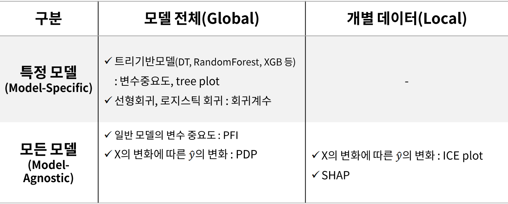

# AI Model Evaluation : AI 모델 평가와 해석
### 목차
[모델 해석 방식 분류 이미지 보기](#모델-해석-방식-분류)  
[PFI(Permutation Feature Importance) 설명](#pfipermutation-feature-importance--일반-모델의-변수-중요도)  
[PDP(Partial Dependence Plots) 설명](#pdppartial-dependence-plots--x의-변화에-따른-y_hat의-변화---aㅗ델-전체global)
[ICE plot 설명](#iceindividuyal-conditional-expectation-plot--x의-변화에-따른-y_hat의-변화---개별-데이터local)  


##### Jupyter Code Files : 코드 파일들
- [Review ML and DL : 머신러닝과 딥러닝 리마인드](./jupyterfiles/review_ML_DL.ipynb)  
- [Tree Model Feature Importance : 트리 모델의 변수 중요도](./jupyterfiles/Tree_Model_feature_importance.ipynb)  
    - [Example : Attrition](./jupyterfiles/Feature_Importance_Example.ipynb)  
- [Permutation Feature Importance(PFI) : 일반 모델의 변수 중요도](./jupyterfiles/PFI.ipynb)  
    - [Example : Attrition](./jupyterfiles/PFI_Example.ipynb)  


## 모델 해석 방식 분류
  

## PFI(Permutation Feature Importance) : 일반 모델의 변수 중요도
- 알고리즘과 상관 없이 변수 중요도를 파악할 수 있는 방법이다.
- Permutation(순열) : 순서가 부여된 임의의 집합을 다른 순서로 뒤섞는 연산
- Feature 하나의 데이터를 무작위로 섞을 때, model의 score가 얼마나 감소되는지로 계산한다.  

- Algorithm 구조
    - 특정 Feature j에 대해서, 여러번(K)시도(섞고, Score계산)해서 나온 Score의 평균 계산
    - $i_{j} = s - \frac{1}{K} \displaystyle\sum_{k=1}^{K} S_k,j$
- 단점 : 만약 다중 공선성이 있는 변수가 존재할 때, 특정 변수 하나가 섞이면 관련된 변수는 그대로 있으므로 Score가 별로 줄어들지 않을 수 있다.

- permutation_importance
    ```python
    from sklearn.inspection import permutation_importance
    # 모델 설정하고
    #모델 fit을 마친 뒤,

    pfi = permutation_importance(model, x_val, y_val, n_repeats=10, random_state=2023)
    ```
    - 위 코드에서 permutation_importance의 매개변수 설명
        - model : 아무 모델이나 상관없음
        - x, y
        - n_repeats : 반복 횟수
        - Output
            - importnaces : feature별 반복횟수만큼 계산된 Score
            - importnaces_mean : 변수별 평균
            - importances_std : 변수별 표준편차
## PDP(Partial Dependence Plots) : X의 변화에 따른 y_hat의 변화 - aㅗ델 전체(Global)
- 여러 행에 대한 ICE plot이다.
- 각 ICE plot의 평균선이 바로 PDP 이다.
- 관심 Feature의 값이 변할 때, 모델에 미치는 영향을 시각화한다.
## ICE(Individuyal Conditional Expectation) plot : X의 변화에 따른 y_hat의 변화 - 개별 데이터(Local)
- 개별 행에서 특정 변수의 변화에 따른 예측 값의 변화(영향력) 시각화
    - 변수의 영향력을 파악하는데 유용하다.